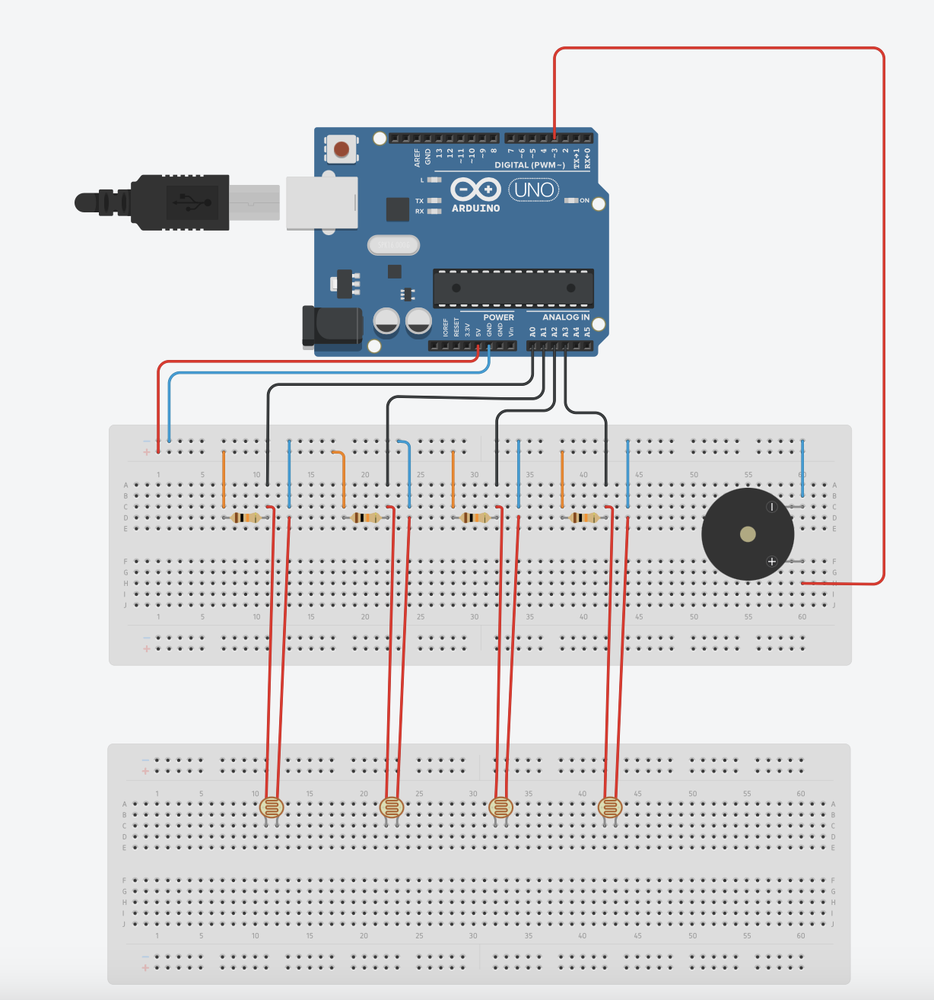
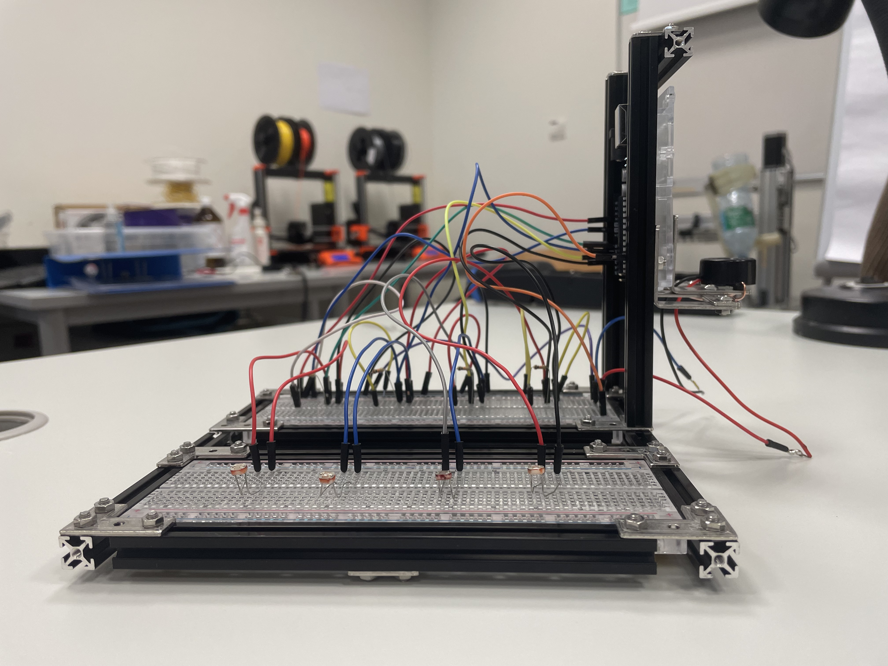
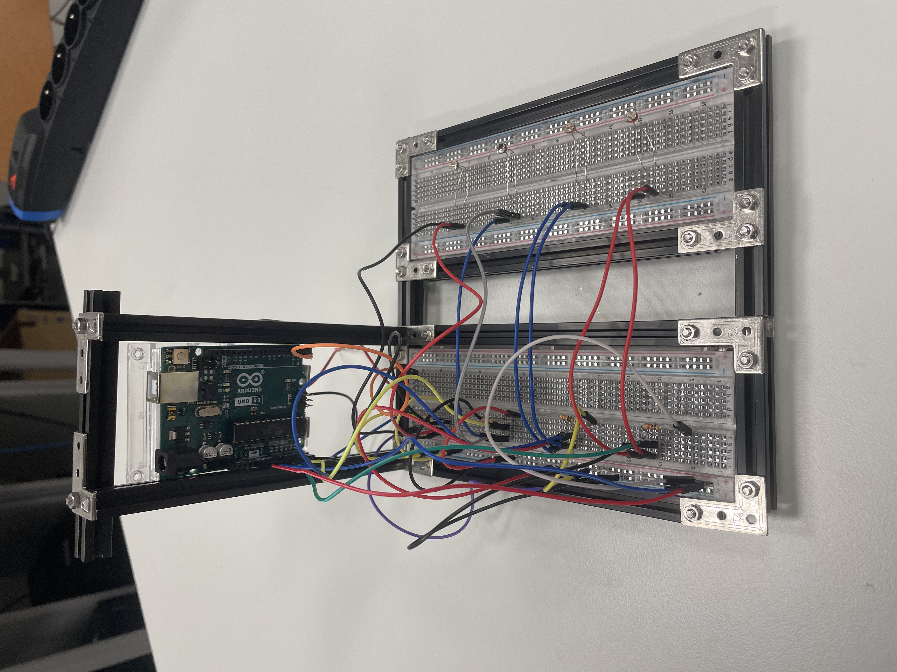
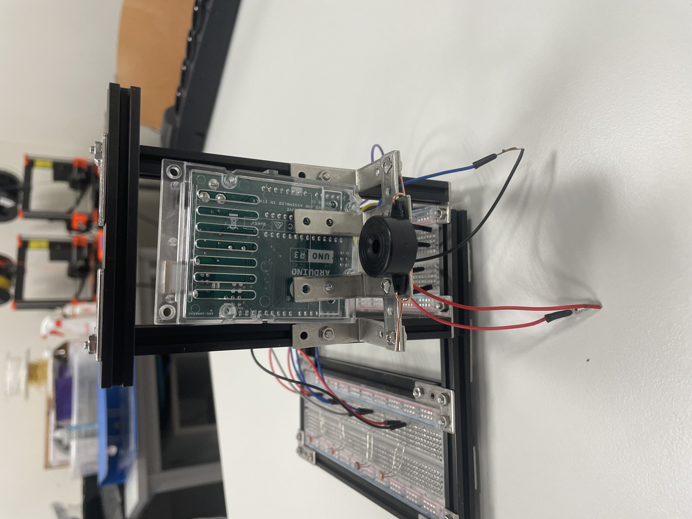

# Termenvox,  based on photoresistors

## Author:
Anastasiia Britan

## Description of the project

Termenvox, based on photoresistors is a musical instrument, which can produce sounds by the differenciating intensity of light. Reglar termenvox uses the changes in magnetic field, so this is a completly different instrument, which looks a bit alike, but a player still do not have to touch the instrument to make it sound.

## Construction of the instrument

| Cicuit overview |
|  |

| Desing overview |
|  |
|  |
|  |

